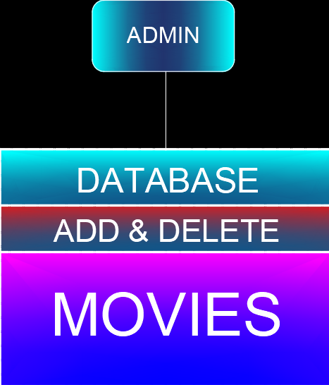
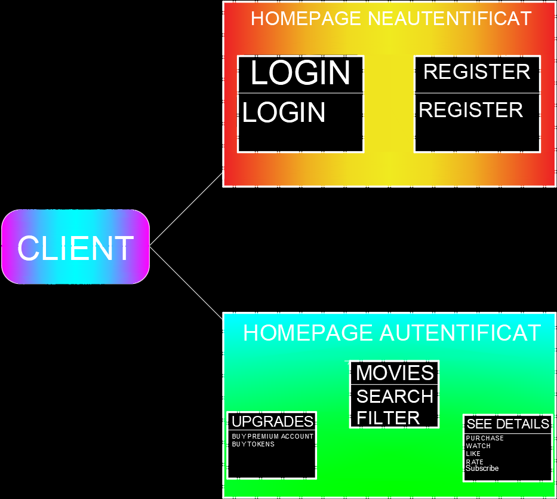

# StreamEase Project Readme
#### Ilinca Sebastian-Ionut 321CA

## Short Description
POO-TV is a project inspired from big stream platforms like *Netflix* and *HBO*. Every user must provide credentials like username, password, origin country. The last one mentioned is a factor which determines the movies available in his region. Users can register later and not be specified in the beginning, unlike movies. Movies are also differentiated with identifiers like actors, genres, countries banned. The platform is not free, so every person who uses it will pay for movies or additional upgrades. The payment method is clear and simple: Users can convert their balance into tokens within the application to pay for movies or upgrades. Tokens are used to pay  for watching a movie and upgrade their standard account to a premium one. A movie is watched by a user giving the "watch" command after purchasing it(the user must be on the page "see details"). A specific movie can be searched by navigating from the "movies" page to the "see details" page with the "change page" command, followed by the movie's name.

## Design Patterns Used
* **SingleTon Design Pattern** is used by *FilterActionClass* for better management regarding given parameters to a method and even prevent usage of unnecessary memory.
* **Visitor Design Pattern** is useful for managing the action of changing pages. Some methods that do not use overload have been included in the Visitor interface to allow better future management.
* **Factory Design Pattern** is used to create a more generic method for creating pages and improve the readability of the code. It is employed in the "change page" action to achieve shorter, clearer code for the same action.
* **Observer Design Pattern** streamlines the process of sending notifications about new movies by simply updating the list and alerting observers, rather than having to call a specific method for each individual user.

## Packages and Classes Explained
* **io**: This package is responsable for interpreting the input given.
* **pages**: Used by Visitor and Visitable interfaces to specify the methods that will be implemented later on. MainPage class implements Visitable to make the design pattern possible. Every other page extends this class overriding the method *accept* by calling the **changePage** method using their instances. It can be visible always the *log* method overrided only by *Login* and *Register* class because this features can only be made by 2 pages.
* **commandcontrol**: For increased readability DecideDependingInput class is created. takeAction method takes care of the entire main flow of the program with two given arguments: input and output.
* **actionmaker**: Is a package that uses abstract and final classes to implement Visitor. Abstract classes are used for logical sense and make the code easy to understang because every class has its own set of commands executed that are genuinely connected in terms of rational thinking.
* **helper**: Package created **ONLY** for increased readability and possibility for future updates. Almost every command in the actionmaker is executed with the help of auxiliary methods where edge cases are treated, changes are being made, errors and output for commands are added to the ArrayNode.
* **factory**: This package has been created to facilitate the implementation of the **Factory Design Pattern**.
* **administrator**: This package is used to enable the addition or removal of movies from the application's database.

## Unusual But Good Practices
* Made use of streams to search through an ArrayList for an object that respect some circumstances given as argument.
* Utilized custom Comparator for sorting movies.

## Is there a better implementation?
* Of course, it is certain that other possible implementations would be more structured, faster, easier to understand and have better memory management.
* Instead using(abusing) streams for everything(from finding a desired element to just check if there is at least one element that respects a condition) the code could have a Map for some Lists.
* Instead of making an entire method for a recommendation, the program could have a priority with a custom Comparator.


## Difficulties
* Not overriding right the accept method for *Upgrades* page by missing an argument(Very long debugging for this one).
* Understanding how the **Visitor Design Pattern** works.
* Understand and treat edge cases.
* Discovering how **Observer Design Pattern** works.
* Not knowing from the beggining I have to add the observers.

## Things Learned Working on This Project
* A clear code has a huge impact on debugging.
* Design Patterns have the capacity to increase speed of implementing a project.
* Making the program modularized prevents reinventing the wheel.
* How easy it is to make additions to the code depends on how well the code was built from the start.

## Feedback
1. **(+)** - very creative idea project.
1. **(+)** - a good project to include in a CV.
1. **(+)** - the project give you the possibility to think on your own about implementation.
1. **(+)** - a big appreciation for the team because they made the stage 2 so easy to implement if the first stage of code was very modularized and well structured yet so hard if the code was messy and not modularized at all.
1. **(+)** - very good idea to implement a "back" action.
1. **(+)** - precise explanations(Stage 2).
1. **(+)** - the fact that an admin can add movies and users can subscribe to a specified genre, receiving notifications made the project itself a very creative one.
1. **(-)** - not specifying error cases, this caused decreased speed of debugging(Stage 1).
1. **(-)** - made wrong tests and correct them after the implementation was created specially for the first series of tests, but everyone make mistakes, so it's not a big deal, but I thought that this should be mentioned.

## Additional comments
* The program was designed on purpose to be as modularized as possible for future commands.
* Did not feel the need to explicitly comment about the code as every method has its own comment and variables/methods have suggestive names.

## Suggestive images



* These photos were created using AutoCAD.(Tried my best making them, I am not talented in this field).


## Last But Not Least
```
String bufferEnding = "If something is unclear(about README or code) please contact me at the following email address:";
String bufferEmailAddress = "ilincasebastian1406@gmail.com";
System.out.println(bufferEnding);
System.out.println(bufferEmailAddress);
```
